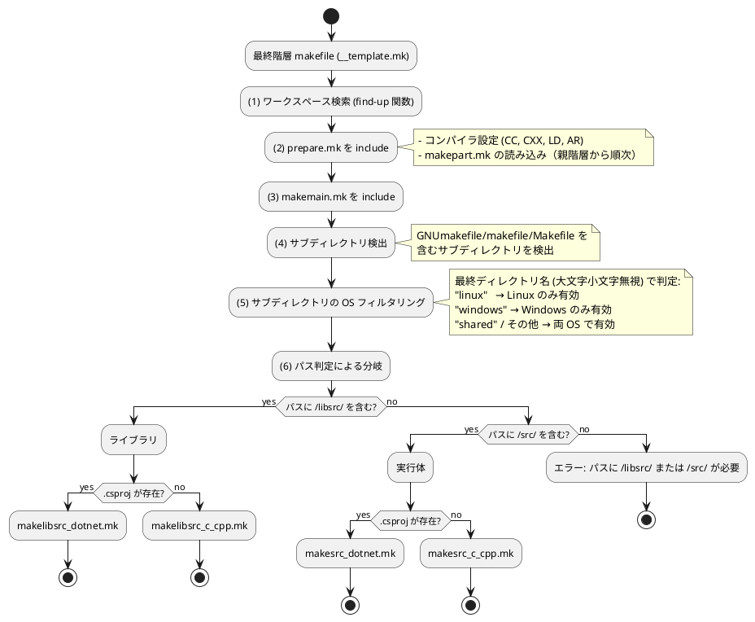

# makefile テンプレート自動選択機構

本ドキュメントでは、makefw フレームワークにおける makefile テンプレートの自動選択機構について説明します。

## 概要

makefw では、すべての最終階層 makefile を統一テンプレート (`__template.mk`) に統一し、ディレクトリパスと言語の自動判定により、適切なビルドテンプレートを自動的に選択します。

これにより、以下のメリットが得られます：

- **完全な統一**: すべての makefile が同一内容になり、メンテナンスが容易
- **自動判定**: ディレクトリパスと .csproj の有無で自動的に適切なテンプレートを選択
- **柔軟性**: プロジェクト固有の設定は makepart.mk で管理

## アーキテクチャ

### ファイル構成

```text
makefw/makefiles/
+-- __template.mk           # 統一テンプレート（すべての最終階層 makefile で使用）
+-- prepare.mk              # 準備処理（コンパイラ設定、makepart.mk 読み込み）
+-- makemain.mk             # テンプレート自動選択ロジック
+-- auto-select.mk          # パス判定による分岐（makemain.mk と同じ）
+-- makelibsrc_c_cpp.mk     # C/C++ ライブラリビルド用テンプレート
+-- makelibsrc_dotnet.mk    # .NET ライブラリビルド用テンプレート
+-- makesrc_c_cpp.mk        # C/C++ 実行体ビルド用テンプレート
+-- makesrc_dotnet.mk       # .NET 実行体ビルド用テンプレート
```

### 処理フロー



## 統一テンプレート (__template.mk)

すべての最終階層 makefile で使用する標準テンプレートです。

```makefile
# makefile テンプレート
# すべての最終階層 makefile で使用する標準テンプレート
# 本ファイルの編集は禁止する。makepart.mk を作成して拡張・カスタマイズすること。

# ワークスペースのディレクトリ
find-up = \
    $(if $(wildcard $(1)/$(2)),$(1),\
        $(if $(filter $(1),$(patsubst %/,%,$(dir $(1)))),,\
            $(call find-up,$(patsubst %/,%,$(dir $(1))),$(2))\
        )\
    )
WORKSPACE_FOLDER := $(strip $(call find-up,$(CURDIR),.workspaceRoot))

# 準備処理 (ビルドテンプレートより前に include)
include $(WORKSPACE_FOLDER)/makefw/makefiles/prepare.mk

##### makepart.mk の内容は、このタイミングで処理される #####

# ビルドテンプレートを include
include $(WORKSPACE_FOLDER)/makefw/makefiles/makemain.mk
```

### 重要なポイント

1. **統一性**: すべての最終階層 makefile が完全に同一
2. **編集禁止**: 固有の設定は makepart.mk に記述
3. **処理順序**: prepare.mk → makepart.mk → makemain.mk

## 自動選択ロジック (makemain.mk)

ディレクトリパスと .csproj の有無により、適切なビルドテンプレートを自動選択します。

```makefile
# カレントディレクトリのパス判定による自動テンプレート選択
#
# ディレクトリパターン:
#   /libsrc/ を含む → ライブラリ用テンプレート (makelibsrc_*.mk)
#   /src/    を含む → 実行体用テンプレート (makesrc_*.mk)
#
# 言語判定:
#   .csproj が存在 → .NET 用テンプレート (*_dotnet.mk)
#   .csproj が無い → C/C++ 用テンプレート (*_c_cpp.mk)

# パスに /libsrc/ を含む場合はライブラリ用テンプレート
ifneq (,$(findstring /libsrc/,$(CURDIR)))
    # .csproj があれば .NET ライブラリ、なければ C/C++ ライブラリ
    ifneq ($(wildcard *.csproj),)
        include $(WORKSPACE_FOLDER)/makefw/makefiles/makelibsrc_dotnet.mk
    else
        include $(WORKSPACE_FOLDER)/makefw/makefiles/makelibsrc_c_cpp.mk
    endif
# パスに /src/ を含む場合は実行ファイル用テンプレート
else ifneq (,$(findstring /src/,$(CURDIR)))
    # .csproj があれば .NET 実行体、なければ C/C++ 実行体
    ifneq ($(wildcard *.csproj),)
        include $(WORKSPACE_FOLDER)/makefw/makefiles/makesrc_dotnet.mk
    else
        include $(WORKSPACE_FOLDER)/makefw/makefiles/makesrc_c_cpp.mk
    endif
else
    $(error Cannot auto-select makefile template. Current path must contain /libsrc/ or /src/: $(CURDIR))
endif
```

### 判定ルール

| ディレクトリパス | .csproj | 選択されるテンプレート |
|--------------|---------|-------------------|
| `/libsrc/` を含む | 無し | `makelibsrc_c_cpp.mk` |
| `/libsrc/` を含む | 有り | `makelibsrc_dotnet.mk` |
| `/src/` を含む | 無し | `makesrc_c_cpp.mk` |
| `/src/` を含む | 有り | `makesrc_dotnet.mk` |
| 上記以外 | - | エラー |

## サブディレクトリの OS フィルタリング

makemain.mk では、サブディレクトリの再帰的 make 処理に先立ち、ディレクトリ名に基づく OS フィルタリングを行います。これにより、プラットフォーム固有のコードをディレクトリ単位で分離できます。

### フィルタルール

サブディレクトリの**最終ディレクトリ名**（大文字小文字を無視）に基づいて、以下のルールで判定されます：

| 最終ディレクトリ名 | Linux | Windows | 説明 |
|---|:---:|:---:|---|
| `linux` | 有効 | 除外 | Linux 固有のコード |
| `windows` | 除外 | 有効 | Windows 固有のコード |
| `shared` | 有効 | 有効 | 両 OS 共通コード（明示的） |
| その他 | 有効 | 有効 | デフォルト動作 |

- `shared` とその他は動作上同じですが、`shared` はクロスプラットフォームであることを明示する意図で使用します。
- 大文字小文字を無視するため、`Linux`、`LINUX`、`linux` はすべて同一視されます。

### 判定の仕組み

```makefile
# 小文字変換関数 (pure Make, shell 呼び出し不要)
_lc = $(subst A,a,$(subst B,b,$(subst C,c,...$(subst Z,z,$(1))...)))

# ディレクトリパスの最終コンポーネントを小文字で取得
# e.g., "foo/Linux/" -> "linux", "Windows/" -> "windows"
_dir_lc_name = $(call _lc,$(notdir $(patsubst %/,%,$(1))))

# OS フィルタ: 現在の OS に適合するサブディレクトリのみ残す
define _os_filter_subdir
$(strip \
    $(if $(filter linux,$(call _dir_lc_name,$(1))),\
        $(if $(filter Windows_NT,$(OS)),,$(1)),\
    $(if $(filter windows,$(call _dir_lc_name,$(1))),\
        $(if $(filter Windows_NT,$(OS)),$(1),),\
    $(1))))
endef

SUBDIRS := $(foreach d,$(SUBDIRS),$(call _os_filter_subdir,$(d)))
```

ポイント：

- **`_lc` 関数**: `$(subst A,a,...)`の連鎖による pure Make 実装。`$(shell)` 呼び出しを回避し、パフォーマンスに影響しない
- **`_dir_lc_name` 関数**: `$(patsubst %/,%,...)` で末尾の `/` を除去し、`$(notdir ...)` で最終コンポーネントを取得後、小文字化
- **OS 判定**: `$(OS)` 変数の値（`Windows_NT` または未設定）で Linux/Windows を判別。`_should_skip.mk` と同一のパターン

### ディレクトリ構成例

```text
prod/calc/src/calcapp/
+-- makefile
+-- shared/          # 両 OS で有効（明示的）
|   +-- makefile
|   +-- common.c
+-- linux/           # Linux でのみ有効
|   +-- makefile
|   +-- platform_linux.c
+-- windows/         # Windows でのみ有効
|   +-- makefile
|   +-- platform_windows.c
+-- utils/           # 両 OS で有効（デフォルト）
    +-- makefile
    +-- helper.c
```

#### Linux での実行結果

```text
SUBDIRS = linux/ shared/ utils/
# windows/ は除外される
```

#### Windows での実行結果

```text
SUBDIRS = shared/ utils/ windows/
# linux/ は除外される
```

### 複数階層での動作

サブディレクトリが複数階層にまたがる場合、各階層で個別にフィルタリングが適用されます。最終ディレクトリ名のみで判定されるため、中間階層の名前は影響しません。

```text
prod/calc/src/calcapp/
+-- platform/           # "platform" → 両 OS で有効
    +-- makefile
    +-- linux/           # "linux" → Linux でのみ有効
    |   +-- makefile
    |   +-- impl_linux.c
    +-- windows/         # "windows" → Windows でのみ有効
        +-- makefile
        +-- impl_windows.c
```

この場合、`calcapp/` レベルでは `platform/` が両 OS で有効となり、`platform/` 内で再帰的に make が実行される際に `linux/` または `windows/` がフィルタリングされます。

## 使用例

### C/C++ ライブラリ

```text
ディレクトリ: prod/calc/libsrc/calcbase/
ファイル構成:
  - makefile (__template.mk の内容)
  - add.c, subtract.c, multiply.c, divide.c
  - makepart.mk (固有設定、必要な場合のみ)

判定結果:
  パス: /libsrc/ を含む → ライブラリ
  .csproj: 無し → C/C++
  → makelibsrc_c_cpp.mk を使用
```

### .NET ライブラリ

```text
ディレクトリ: prod/calc.net/libsrc/CalcLib/
ファイル構成:
  - makefile (__template.mk の内容)
  - CalcLib.csproj
  - Calculator.cs
  - makepart.mk (固有設定、必要な場合のみ)

判定結果:
  パス: /libsrc/ を含む → ライブラリ
  .csproj: 有り → .NET
  → makelibsrc_dotnet.mk を使用
```

### C/C++ 実行体

```text
ディレクトリ: prod/calc/src/add/
ファイル構成:
  - makefile (__template.mk の内容)
  - add.c
  - makepart.mk (固有設定、必要な場合のみ)

判定結果:
  パス: /src/ を含む → 実行体
  .csproj: 無し → C/C++
  → makesrc_c_cpp.mk を使用
```

### .NET 実行体

```text
ディレクトリ: prod/calc.net/src/CalcApp/
ファイル構成:
  - makefile (__template.mk の内容)
  - CalcApp.csproj
  - Program.cs
  - makepart.mk (固有設定、必要な場合のみ)

判定結果:
  パス: /src/ を含む → 実行体
  .csproj: 有り → .NET
  → makesrc_dotnet.mk を使用
```

## プロジェクト固有設定 (makepart.mk)

各プロジェクト固有の設定は、`makepart.mk` ファイルに記述します。

### makepart.mk の配置場所

makepart.mk は、以下の階層に配置できます：

1. **カレントディレクトリ** - 最も優先される
2. **親ディレクトリ（複数）** - ワークスペースルートまで遡って検索
3. **複数の階層** - 親階層から順次読み込まれる

### makepart.mk の読み込みタイミング

prepare.mk 内で、親階層からワークスペースルートに向かって順次読み込まれます。

```makefile
# prepare.mk 内の処理
MAKEPART_MK := $(shell \
    dir=`pwd`; \
    while [ "$$dir" != "/" ]; do \
        if [ -f "$$dir/makepart.mk" ]; then \
            echo "$$dir/makepart.mk"; \
        fi; \
        if [ -f "$$dir/.workspaceRoot" ]; then \
            break; \
        fi; \
        dir=$${dir%/*}; \
        if [ -z "$$dir" ]; then dir=/; fi; \
    done \
)

# 逆順にして親階層から順次 include (Make 関数で実現)
_reverse = $(if $(1),$(call _reverse,$(wordlist 2,$(words $(1)),$(1))) $(firstword $(1)))
MAKEPART_MK := $(strip $(call _reverse,$(MAKEPART_MK)))
$(foreach makepart, $(MAKEPART_MK), $(eval include $(makepart)))
```

### makepart.mk の記述例

**例1: 動的ライブラリの指定**

```makefile
# prod/calc/libsrc/calc/makepart.mk

# ライブラリの追加
LIBS += calcbase

ifeq ($(OS),Windows_NT)
    # Windows: DLL エクスポート定義
    CFLAGS   += /DCALC_EXPORTS
    CXXFLAGS += /DCALC_EXPORTS
endif

# 生成されるライブラリを動的ライブラリ (shared) とする
# 未指定の場合 (デフォルト) は static
LIB_TYPE = shared
```

**例2: テスト共通設定**

```makefile
# test/makepart.mk

# テストフレームワークをリンク
LINK_TEST = 1

# テスト関連ライブラリは、すべて静的リンクとする
ifeq ($(OS),Windows_NT)
    # Windows: CALC_STATIC マクロを定義
    CFLAGS   += /DCALC_STATIC
    CXXFLAGS += /DCALC_STATIC
endif

# ライブラリ検索パスの追加
LIBSDIR += \
    $(WORKSPACE_FOLDER)/testfw/lib \
    $(WORKSPACE_FOLDER)/test/lib
```

## 導入方法

既存プロジェクトに makefile テンプレート自動選択機構を導入する手順を説明します。

### 1. 最終階層 makefile の更新

すべての最終階層 makefile を `__template.mk` の内容で置き換えます。

```bash
# 例: prod/calc/libsrc/calcbase/makefile を更新
cp makefw/makefiles/__template.mk prod/calc/libsrc/calcbase/makefile
```

### 2. 固有設定の移行

既存の makefile に固有設定（LIBS, CFLAGS など）がある場合、`makepart.mk` に移行します。

**変更前 (makefile):**
```makefile
# ワークスペースのディレクトリ
find-up = ...
WORKSPACE_FOLDER := $(strip $(call find-up,$(CURDIR),.workspaceRoot))

include $(WORKSPACE_FOLDER)/makefw/makefiles/prepare.mk

# 固有設定
LIBS += calcbase
LIB_TYPE = shared

include $(WORKSPACE_FOLDER)/makefw/makefiles/makelibsrc.mk
```

**変更後:**

**makefile (__template.mk の内容):**
```makefile
# makefile テンプレート
# すべての最終階層 makefile で使用する標準テンプレート
# 本ファイルの編集は禁止する。makepart.mk を作成して拡張・カスタマイズすること。

# ワークスペースのディレクトリ
find-up = ...
WORKSPACE_FOLDER := $(strip $(call find-up,$(CURDIR),.workspaceRoot))

# 準備処理 (ビルドテンプレートより前に include)
include $(WORKSPACE_FOLDER)/makefw/makefiles/prepare.mk

##### makepart.mk の内容は、このタイミングで処理される #####

# ビルドテンプレートを include
include $(WORKSPACE_FOLDER)/makefw/makefiles/makemain.mk
```

**makepart.mk (固有設定):**
```makefile
# ライブラリの追加
LIBS += calcbase

# 動的ライブラリとして固定
LIB_TYPE = shared
```

### 3. 動作確認

```bash
cd prod/calc/libsrc/calcbase
make clean
make
```

## トラブルシューティング

### エラー: "Cannot auto-select makefile template"

**原因**: ディレクトリパスに `/libsrc/` も `/src/` も含まれていない

**解決策**:
1. ディレクトリ構造を見直し、`libsrc` または `src` の下に配置する
2. または、makefile で直接テンプレートを指定する（自動選択を使わない）

### ビルドが失敗する

**確認事項**:
1. `makepart.mk` の内容が正しいか
2. `WORKSPACE_FOLDER` が正しく設定されているか（`.workspaceRoot` ファイルの配置）
3. 依存ライブラリが正しくビルドされているか

**デバッグ方法**:
```bash
make debug  # 変数の内容を表示
```

## まとめ

makefile テンプレート自動選択機構により、以下が実現されます：

- **統一性**: すべての makefile が同一内容
- **自動化**: ディレクトリパスと言語の自動判定
- **保守性**: 固有設定は makepart.mk で管理
- **拡張性**: 新しい言語やビルドタイプの追加が容易

この機構により、プロジェクト全体のビルドシステムが統一され、メンテナンスが大幅に容易になります。
