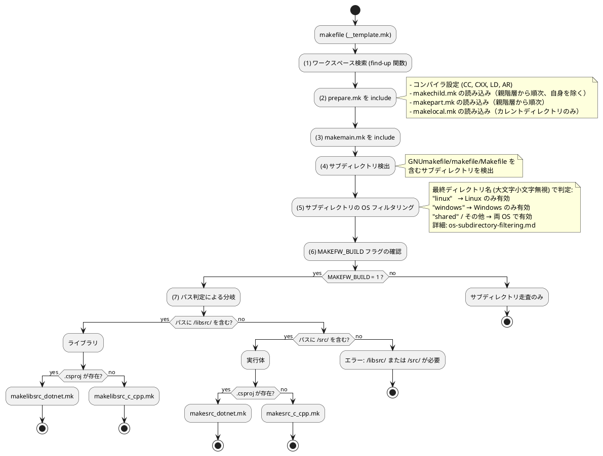

# makefile テンプレート自動選択機構

本ドキュメントでは、makefw フレームワークにおける makefile テンプレートの自動選択機構について説明します。

## 概要

makefw では、`app/<app_name>/makefile` 用の app 直下テンプレート (`__app_root_template.mk`) と、配下の makefile (最終ビルド層・中間走査層) 用の統一テンプレート (`__template.mk`) を使い分けます。ビルドを行うかどうかは `MAKEFW_BUILD` フラグで制御します。フラグが未設定の場合はカレント ディレクトリ直下のビルド対象ソース有無で自動判定し、直下にソースがあればビルドを実行します。

これにより、以下のメリットが得られます:

- **役割ごとの統一**: app 直下用と配下用でテンプレートを固定し、メンテナンスを容易にする
- **ビルド/走査の自動分離**: 直下のソース有無で自動判定し、新規ディレクトリへの明示設定が不要
- **自動判定**: ディレクトリ パスと .csproj の有無で自動的に適切なビルド テンプレートを選択
- **柔軟性**: プロジェクト固有の設定は makepart.mk で管理

## アーキテクチャー

### ファイル構成

```text
framework/makefw/makefiles/
+-- __app_root_template.mk  # app/<app_name>/makefile 用テンプレート
+-- __template.mk           # 配下の makefile 用統一テンプレート
+-- prepare.mk              # 準備処理（コンパイラ設定、makepart.mk / makechild.mk / makelocal.mk 読み込み）
+-- makemain.mk             # MAKEFW_BUILD フラグに基づくビルドテンプレート選択ロジック
+-- makelibsrc_c_cpp.mk     # C/C++ ライブラリビルド用テンプレート
+-- makelibsrc_dotnet.mk    # .NET ライブラリビルド用テンプレート
+-- makesrc_c_cpp.mk        # C/C++ 実行体ビルド用テンプレート
+-- makesrc_dotnet.mk       # .NET 実行体ビルド用テンプレート
```

### 処理フロー



## app 直下テンプレート (__app_root_template.mk)

`app/<app_name>/makefile` で使用する標準テンプレートです。`prod` / `test` の呼び出し、`doxy` 実行、ログ ファイル管理を担当します。

## 統一テンプレート (__template.mk)

配下の makefile (最終ビルド層・中間走査層) で使用する標準テンプレートです。

```makefile
# app 配下 makefile テンプレート
# すべての app/<app_name>/.../makefile で使用する標準テンプレート
# 本ファイルの直接編集は禁止する。

# ワークスペースのディレクトリ
find-up = \
    $(if $(wildcard $(1)/$(2)),$(1),\
        $(if $(filter $(1),$(patsubst %/,%,$(dir $(1)))),,\
            $(call find-up,$(patsubst %/,%,$(dir $(1))),$(2))\
        )\
    )

# 再帰 make 間でワークスペース ルートは不変のため、内部キャッシュ変数で継承する
ifeq ($(origin MAKEFW_WORKSPACE_DIR), undefined)
    MAKEFW_WORKSPACE_DIR := $(strip $(call find-up,$(CURDIR),.workspaceRoot))
endif
export MAKEFW_WORKSPACE_DIR

WORKSPACE_DIR := $(MAKEFW_WORKSPACE_DIR)

# 準備処理 (ビルド テンプレートより前に include)
include $(WORKSPACE_DIR)/framework/makefw/makefiles/prepare.mk

##### makepart.mk の内容は、このタイミングで処理される #####

# ビルド テンプレートを include
include $(WORKSPACE_DIR)/framework/makefw/makefiles/makemain.mk
```

### 重要なポイント

1. **統一性**: 配下の最終ビルド層・中間走査層のすべての makefile が完全に同一
2. **編集禁止**: 固有の設定は makepart.mk / makechild.mk / makelocal.mk に記述
3. **処理順序**: prepare.mk → makechild.mk / makepart.mk / makelocal.mk → makemain.mk

## 自動選択ロジック (makemain.mk)

ディレクトリ パスと .csproj の有無により、適切なビルド テンプレートを自動選択します。  
`MAKEFW_BUILD` が未設定の場合はカレント ディレクトリ直下のビルド対象ソース有無で自動判定します。明示的に `:= 1` / `:= 0` を設定している場合は、その設定が優先されます。

```makefile
# カレント ディレクトリのパス判定による自動テンプレート選択
# MAKEFW_BUILD が未設定の場合は、直下のビルド対象ソース有無で自動判定する
# (明示設定は自動判定より優先される)

# MAKEFW_BUILD 未設定時の自動判定
ifeq ($(MAKEFW_BUILD),)
    ifneq (,$(findstring /libsrc/,$(CURDIR))$(findstring /src/,$(CURDIR)))
        ifneq ($(strip $(wildcard *.c) $(wildcard *.cc) $(wildcard *.cpp) $(wildcard *.csproj) $(TEST_SRCS) $(ADD_SRCS)),)
            MAKEFW_BUILD := 1
        else
            MAKEFW_BUILD := 0
        endif
    else
        MAKEFW_BUILD := 0
    endif
endif

ifeq ($(MAKEFW_BUILD),1)

# パスに /libsrc/ を含む場合はライブラリ用テンプレート
ifneq (,$(findstring /libsrc/,$(CURDIR)))
    ifneq ($(wildcard *.csproj),)
        include $(WORKSPACE_DIR)/framework/makefw/makefiles/makelibsrc_dotnet.mk
    else
        include $(WORKSPACE_DIR)/framework/makefw/makefiles/makelibsrc_c_cpp.mk
    endif
# パスに /src/ を含む場合は実行ファイル用テンプレート
else ifneq (,$(findstring /src/,$(CURDIR)))
    ifneq ($(wildcard *.csproj),)
        include $(WORKSPACE_DIR)/framework/makefw/makefiles/makesrc_dotnet.mk
    else
        include $(WORKSPACE_DIR)/framework/makefw/makefiles/makesrc_c_cpp.mk
    endif
else
    $(error Cannot auto-select makefile template. MAKEFW_BUILD=1 requires /libsrc/ or /src/ in path: $(CURDIR))
endif

endif  # MAKEFW_BUILD
```

### 自動判定のルール

`MAKEFW_BUILD` が未設定のとき、以下の条件で 1 または 0 を自動設定します。

| 条件 | 判定結果 |
|------|---------|
| パスに `/libsrc/` または `/src/` を含み、かつ直下に `*.c` / `*.cc` / `*.cpp` / `*.csproj` が存在する | `1` (ビルド実行) |
| パスに `/libsrc/` または `/src/` を含み、かつ `TEST_SRCS` / `ADD_SRCS` が指定されている | `1` (ビルド実行) |
| 上記以外 | `0` (走査のみ) |

判定後は通常どおり以下のパス分岐でテンプレートを選択します。

| ディレクトリ パス | .csproj | 選択されるテンプレート |
|--------------|---------|-------------------|
| `/libsrc/` を含む | 無し | `makelibsrc_c_cpp.mk` |
| `/libsrc/` を含む | 有り | `makelibsrc_dotnet.mk` |
| `/src/` を含む | 無し | `makesrc_c_cpp.mk` |
| `/src/` を含む | 有り | `makesrc_dotnet.mk` |
| 上記以外 | - | エラー |

### MAKEFW_BUILD の明示設定が必要なケース

通常は自動判定で対応できます。以下のケースのみ `makelocal.mk` への明示設定が必要です。

| ケース | ファイル | 設定例 | 理由 |
|-------|--------|--------|------|
| サブフォルダーのみにソースを置くライブラリ ルート | `libsrc/<lib>/makelocal.mk` | `MAKEFW_BUILD := 1` | 直下ソースがゼロのため自動判定では 0 と誤判定される |
| 意図的にビルドを無効化したいディレクトリ | 任意の `makelocal.mk` | `MAKEFW_BUILD := 0` | 直下にソースがあっても走査のみにしたい場合 |

`prepare.mk` は `makelocal.mk` を最後に読み込むため、明示設定は自動判定を確実に上書きします。

## サブディレクトリの OS フィルタリング

サブディレクトリ名に基づく OS フィルタリングの詳細は、[サブディレクトリの OS フィルタリング](os-subdirectory-filtering.md) を参照してください。

## 使用例

### C/C++ ライブラリ

```text
ディレクトリ: app/calc/prod/libsrc/calc/
ファイル構成:
  - makefile (__template.mk の内容)
  - add.c, subtract.c, multiply.c, divide.c
  - makepart.mk (固有設定、必要な場合のみ)

判定結果:
  MAKEFW_BUILD: 1 (直下ソースあり → 自動判定)
  パス: /libsrc/ を含む → ライブラリ
  .csproj: 無し → C/C++
  → makelibsrc_c_cpp.mk を使用
```

### .NET ライブラリ

```text
ディレクトリ: app/calc.net/prod/libsrc/CalcLib/
ファイル構成:
  - makefile (__template.mk の内容)
  - CalcLib.csproj
  - Calculator.cs
  - makepart.mk (固有設定、必要な場合のみ)

判定結果:
  MAKEFW_BUILD: 1 (直下ソースあり → 自動判定)
  パス: /libsrc/ を含む → ライブラリ
  .csproj: 有り → .NET
  → makelibsrc_dotnet.mk を使用
```

### C/C++ 実行体

```text
ディレクトリ: app/calc/prod/src/add/
ファイル構成:
  - makefile (__template.mk の内容)
  - add.c
  - makepart.mk (固有設定、必要な場合のみ)

判定結果:
  MAKEFW_BUILD: 1 (直下ソースあり → 自動判定)
  パス: /src/ を含む → 実行体
  .csproj: 無し → C/C++
  → makesrc_c_cpp.mk を使用
```

### .NET 実行体

```text
ディレクトリ: app/calc.net/prod/src/CalcApp/
ファイル構成:
  - makefile (__template.mk の内容)
  - CalcApp.csproj
  - Program.cs
  - makepart.mk (固有設定、必要な場合のみ)

判定結果:
  MAKEFW_BUILD: 1 (直下ソースあり → 自動判定)
  パス: /src/ を含む → 実行体
  .csproj: 有り → .NET
  → makesrc_dotnet.mk を使用
```

## プロジェクト固有設定 (makepart.mk)

各プロジェクト固有の設定は、`makepart.mk` ファイルに記述します。

### makepart.mk の配置場所

makepart.mk は、以下の階層に配置できます:

1. **カレント ディレクトリ** - 最も優先される
2. **親ディレクトリ (複数)** - ワークスペース ルートまで遡って検索
3. **複数の階層** - 親階層から順次読み込まれる

### makepart.mk / makechild.mk / makelocal.mk の読み込みタイミング

`prepare.mk` 内で、以下の順序で読み込まれます:

1. **makechild.mk + makepart.mk**: ワークスペース ルートからカレント ディレクトリまでの各階層を走査。  
   `makechild.mk` はカレント ディレクトリ自身を除外 (子階層以降にのみ適用)。
2. **makelocal.mk**: カレント ディレクトリのみ。`makechild.mk` より後に読み込まれるため、フラグの上書きに使用。

### makepart.mk の記述例

**例 1: 動的ライブラリの指定**

```makefile
# app/calc/prod/libsrc/calc/makepart.mk

# ライブラリの追加
LIBS += calcbase

ifeq ($(OS),Windows_NT)
    # Windows: DLL エクスポート定義
    CFLAGS   += /DCALC_EXPORTS
    CXXFLAGS += /DCALC_EXPORTS
endif

# 生成されるライブラリを動的ライブラリ (shared) とする
# 未指定の場合 (デフォルト) は static
# both を指定すると shared + static の両方を生成する (static 側は名前に _static が付く)
LIB_TYPE = shared
```

**例 2: テスト共通設定**

```makefile
# app/calc/test/makepart.mk

# テスト関連ライブラリは、すべて静的リンクとする
ifeq ($(OS),Windows_NT)
    # Windows: CALC_STATIC マクロを定義
    CFLAGS   += /DCALC_STATIC
    CXXFLAGS += /DCALC_STATIC
endif
```

`INCDIR` と `LIBSDIR` の依存 app / test 用のパスは `prepare.mk` が補完するため、個別の `makepart.mk` では Windows 向けの静的定義だけを残せます。

## 導入方法

既存プロジェクトに makefile テンプレート自動選択機構を導入する手順を説明します。

すべての階層の makefile (最終ビルド層・中間走査層) が `__template.mk` と同一内容になります。  
ビルドを行うかどうかは、カレント ディレクトリ直下のソース有無で自動判定します。

### すべての makefile を更新

すべての makefile を `__template.mk` の内容で置き換えます。

```bash
# 例: app/calc/prod/libsrc/calc/makefile を更新
cp framework/makefw/makefiles/__template.mk app/calc/prod/libsrc/calc/makefile

# 一括更新には保守コマンドを使用
python framework/makefw/bin/update_template_makefiles.py
```

### MAKEFW_BUILD の設定

通常、`MAKEFW_BUILD` の設定は不要です。`/libsrc/` または `/src/` 配下のディレクトリで直下に `*.c` / `*.cc` / `*.cpp` / `*.csproj` が存在するか、`TEST_SRCS` / `ADD_SRCS` が指定されていれば、自動的にビルドが実行されます。

ただし、サブフォルダーのみにソースを置くライブラリ ルート (サブフォルダーコンパイル方式) は直下ソースがゼロのため自動判定では走査のみになります。このケースのみ `makelocal.mk` に明示設定が必要です。

```makefile
# app/com_util/prod/libsrc/com_util/makelocal.mk
# サブフォルダーのみにソースを持つライブラリ ルート。
# 自動判定では 0 と誤判定されるため、ビルド対象として明示する。
MAKEFW_BUILD := 1
```

`makelocal.mk` はカレント ディレクトリにのみ適用されるため、配下の中間走査層は影響を受けません。

### 固有設定の移行

既存の makefile に固有設定 (LIBS, CFLAGS など) がある場合、`makepart.mk` に移行します。

**変更前 (makefile):**

```makefile
include $(WORKSPACE_DIR)/framework/makefw/makefiles/prepare.mk

# 固有設定
LIBS += calcbase
LIB_TYPE = shared

include $(WORKSPACE_DIR)/framework/makefw/makefiles/makelibsrc_c_cpp.mk
```

**変更後:**

**makefile (`__template.mk` の内容):**

```makefile
# app 配下 makefile テンプレート
# すべての app/<app_name>/.../makefile で使用する標準テンプレート
# 本ファイルの直接編集は禁止する。

include $(WORKSPACE_DIR)/framework/makefw/makefiles/prepare.mk

##### makepart.mk の内容は、このタイミングで処理される #####

include $(WORKSPACE_DIR)/framework/makefw/makefiles/makemain.mk
```

**makepart.mk (固有設定):**

```makefile
LIBS += calcbase
LIB_TYPE = shared
```

### 動作確認

```bash
cd app/calc/prod/libsrc/calc
make clean
make
```

## トラブルシューティング

### エラー: "Cannot auto-select makefile template"

**原因**: `MAKEFW_BUILD := 1` が設定されているが、ディレクトリ パスに `/libsrc/` も `/src/` も含まれていない

**解決策**:

1. ディレクトリ構造を見直し、`libsrc` または `src` の下に配置する
2. または、当該ディレクトリの `makelocal.mk` に `MAKEFW_BUILD := 0` を設定して走査のみに戻す

### ビルドが実行されない (サブディレクトリ走査のみになる)

**確認事項**:

1. ディレクトリ パスに `/libsrc/` または `/src/` が含まれているか
2. カレント ディレクトリ直下に `*.c` / `*.cc` / `*.cpp` / `*.csproj` が存在するか、あるいは `TEST_SRCS` / `ADD_SRCS` が `makepart.mk` で指定されているか
3. すべてのソースをサブフォルダーに置くライブラリ ルートの場合、`makelocal.mk` に `MAKEFW_BUILD := 1` が設定されているか
4. `makelocal.mk` で `MAKEFW_BUILD := 0` が明示設定されていないか

### ビルドが失敗する

**確認事項**:

1. `makepart.mk` の内容が正しいか
2. `WORKSPACE_DIR` が正しく設定されているか (`.workspaceRoot` ファイルの配置)
3. 依存ライブラリが正しくビルドされているか

**デバッグ方法**:

```bash
make debug  # 変数の内容を表示
```

## まとめ

makefile テンプレート自動選択機構により、以下が実現されます:

- **役割ごとの統一**: app 直下用と配下用でテンプレートを固定
- **ビルド/走査の自動分離**: 直下のソース有無で自動判定し、新規ディレクトリへの明示設定が不要
- **自動化**: ディレクトリ パスと言語の自動判定
- **保守性**: 固有設定は makepart.mk / makelocal.mk で管理
- **拡張性**: 新しい言語やビルド タイプの追加が容易

この機構により、プロジェクト全体のビルド システムが統一され、メンテナンスが大幅に容易になります。

## 保守コマンド

app 直下テンプレートまたは統一テンプレートを更新したあと、すでに配置済みの対応 `makefile` を再同期するには、次の保守コマンドを利用します。

```bash
python framework/makefw/bin/update_template_makefiles.py --dry-run
python framework/makefw/bin/update_template_makefiles.py
```

詳細は [update_template_makefiles.md](update_template_makefiles.md) を参照してください。
